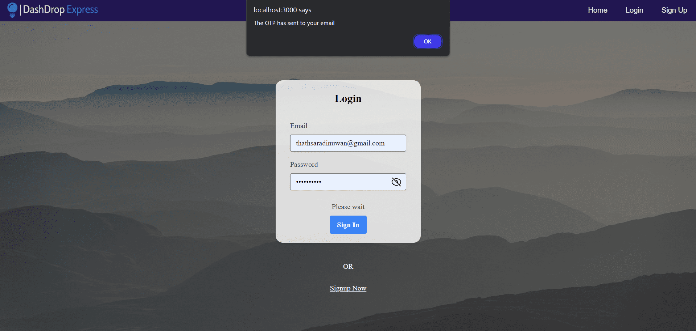
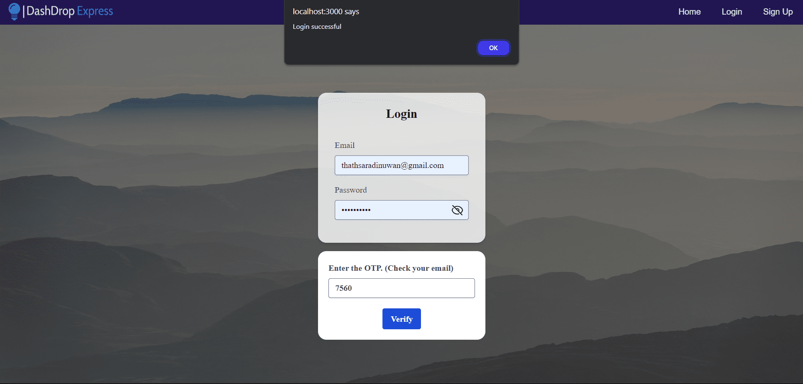
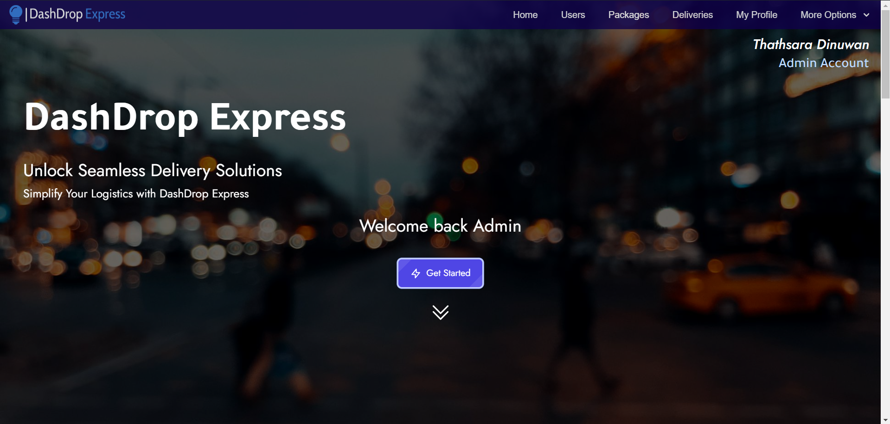
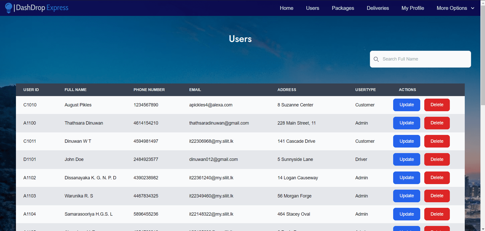
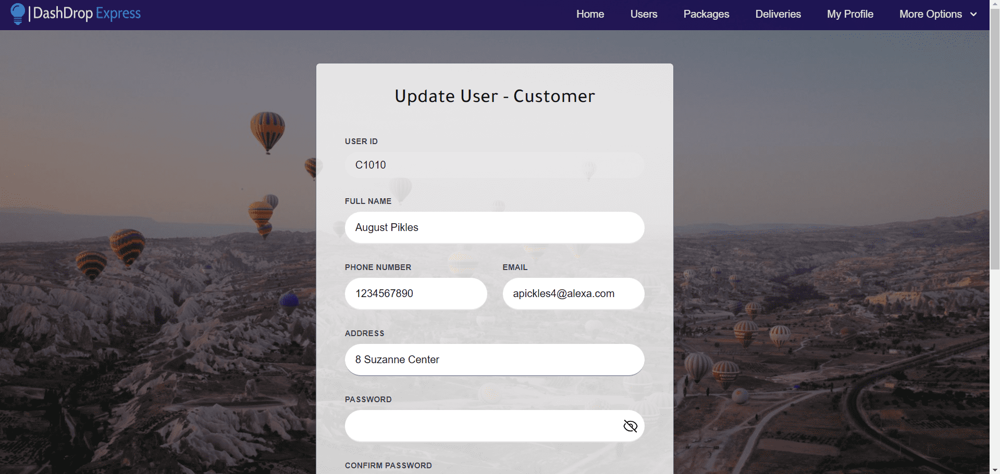
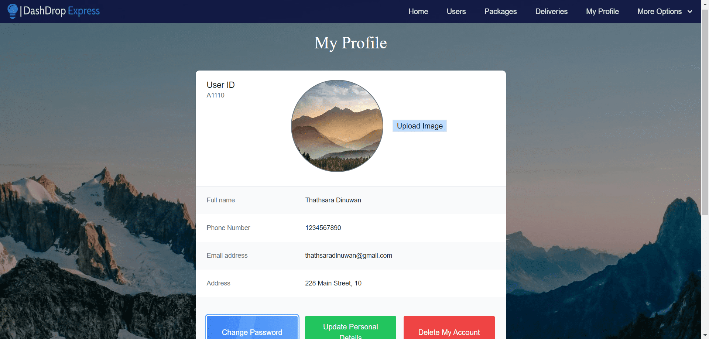

# DashDrop Courier Management System

Description: Developed a comprehensive Courier Management System using the MERN stack as part of IT project module. This system facilitates management of courier services.

Team Size: Collaborated with a team of 8 members to design and implement 8 core functions.

Role: Team Leader and Developer, overseeing project planning, task assignment, and ensuring adherence to timelines. Worked on User Management

Technologies Used: MongoDB, Express.js, React.js, Node.js, JWT for authentication


## Features

- Light/dark mode toggle
- Email verification on login with JWT token
- Intruitive UserInterface
- Easy navigation
- Prioritized security with extensive validations


## API Reference

Following some of the 30+ RESTful APIs used in this project
#### Get user by id

```http
  GET /api/getuserbyid/${id}
```

| Parameter | Type     | Description                       |
| :-------- | :------- | :-------------------------------- |
| `id`      | `string` | **Required**. Id of item to fetch |

#### Changing the password

```http
  POST /api/checkpassword/:id
```
| Parameter           | Type     | Description                       |
| :------------------ | :------- | :-------------------------------- |
| `oldpassword` | `string` | **Required**. Compare the entered password with the existing hashed password, return the suitable status |


#### Verify the OTP

```http
  POST /api/verifyOTP
```
| Parameter           | Type     | Description                       |
| :------------------ | :------- | :-------------------------------- |
| `existingemail`, `existingusertype`, `otp` | `string` | **Required**. verifies the otp entered by the user with otp sent to the email |

#### Upload profile photo

```http
  POST /api/uploadprofilephoto
```

| Parameter | Type     | Description                       |
| :-------- | :------- | :-------------------------------- |
| `id`      | `string` | **Required**. Id of the user is required
 | `base64` | `string` | **Required**. The uploaded image is saved in the database after converting it into base64 string file |








